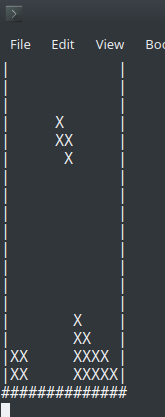

# Tetris
Simple console tetris game. Requires SFML (https://www.sfml-dev.org/).<br/>To compile run: ```g++ tetris.cpp field.cpp tetrominoes.cpp -o tetris -lsfml-window``` <br/>
Didn't test on windows, but it should work there as well.

# Screenshot

